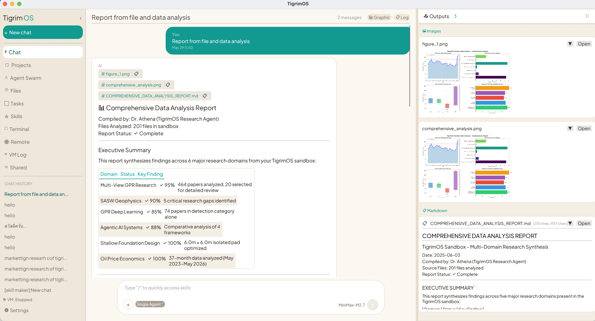

# TigrimOSR v0.2.1

**TigrimOSR** is the Rust version of [TigrimOS](https://github.com/Sompote/TigerCowork) — a high-performance native desktop rewrite of the original Python/Node.js AI assistant. Built entirely in Rust using egui for the UI, TigrimOSR delivers faster startup, lower memory usage, and a single self-contained binary with no Node.js or Python runtime required to run the app itself.

TigrimOSR is a native desktop AI assistant with multi-agent collaboration, tool calling, and file output. It connects to any OpenAI-compatible API (OpenAI, Anthropic via proxy, DeepSeek, local Ollama, etc.) and lets you orchestrate teams of specialist AI agents defined in simple YAML files.



## What's New in v0.2.1

- **Cross-platform support** — Windows and Linux compatibility for sandbox execution, Python/shell discovery, and subprocess spawning
- **.app bundle fixes** — Resolved issues with data directories, sandbox paths, Python/shell not found when launched from macOS `.app` bundle
- **Persistent chat logs** — Agent activity logs now persist after chat completes instead of disappearing
- **Parallel chat streaming** — Multiple chat sessions can stream responses simultaneously via HashMap-based state
- **Installer improvements** — Robust `curl | bash` support with proper cwd handling, terminal prompt fallbacks
- **Zero compiler warnings** — All 162 warnings resolved (deprecated egui APIs, unused imports, dead code)

### v0.2.0

- **Agent modes** — Auto, Fully Auto, Auto Swarm, Realtime, and Manual modes for flexible agent orchestration
- **Connection editor** — Click agent connection lines to change protocol type (TCP, Queue, Bus, Blackboard)
- **Chat info card** — Shows active architecture name, swarm mode, and model in the chat view
- **Security settings** — Per-tool approval toggles for shell, Python, file write, file delete, and agent spawn
- **Sandbox file browser** — Files tab shows only the sandbox folder with image file preview support
- **Task management** — Kill button for active sessions, reordered tabs (Active before Scheduled)
- **Remote task API** — Submit, poll, and kill tasks via HTTP endpoints (`/api/remote/*`)
- **Inter-agent protocols** — TCP, Bus, Queue, and Blackboard communication between agents
- **MCP client** — Model Context Protocol support with stdio, SSE, and HTTP transports
- **Cloudflare tunnel** — Built-in tunnel management for remote access
- **ClawHub marketplace** — Search, install, and manage skills from the ClawHub skill marketplace
- **Custom app icon** — Program icon replaces emoji in the title bar

## Features

- **Multi-agent system** — hierarchical, mesh, and hybrid orchestration modes via YAML config
- **Tool calling** — web search, Python execution, file read/write, shell commands, skill loading
- **Output panel** — inline preview for images (PNG/JPG), markdown reports, CSV tables, JSON, PDF, HTML
- **Agent history log** — JSONL logs per session in `data/agent_history/`
- **Skills system** — loadable skill modules from `skills/` directory
- **Sandboxed Python** — matplotlib plots auto-saved as PNG via Agg backend
- **Resizable layout** — drag handles for chat sidebar and output panel widths
- **Session management** — persistent chat history with project context

## Requirements

- Rust 1.75+ (`rustup` recommended)
- Python 3.8+ with pip (for tool execution)
- macOS 12+ (primary target; Linux supported without sandbox-exec)

### Python packages (optional but recommended)

```bash
pip install duckduckgo-search matplotlib numpy pandas requests
```

## Installation

### Quick Install (recommended)

One-command installer that clones, builds, and sets up the app for you.

**macOS:**
```bash
curl -sSL https://raw.githubusercontent.com/Sompote/TigrimOSR/main/install.sh | bash
```

**Linux:**
```bash
curl -sSL https://raw.githubusercontent.com/Sompote/TigrimOSR/main/install-linux.sh | bash
```

**Windows (PowerShell):**
```powershell
irm https://raw.githubusercontent.com/Sompote/TigrimOSR/main/install.ps1 | iex
```

**Windows (Command Prompt):**
Download and run [`install.bat`](https://raw.githubusercontent.com/Sompote/TigrimOSR/main/install.bat).

The installer will:
1. Check prerequisites (git, Rust)
2. Let you choose an install location
3. Clone and build in release mode
4. Create a native app (macOS `.app` / Linux `.desktop` / Windows shortcut)
5. Optionally launch the app

---

### Manual Install

If you prefer to install manually, follow the steps below.

#### Step 1 — Install Rust

Rust is required to build the app. Install it via `rustup` (the official Rust installer):

**macOS / Linux:**
```bash
curl --proto '=https' --tlsv1.2 -sSf https://sh.rustup.rs | sh
source $HOME/.cargo/env
```

**Windows:**
Download and run [rustup-init.exe](https://win.rustup.rs/) from https://rustup.rs

Verify the installation:
```bash
rustc --version
cargo --version
```

---

#### Step 2 — Install Python

Python is used for code execution, web search, and data analysis tools inside the app.

**macOS (recommended via Homebrew):**
```bash
brew install python
```

**Linux (Ubuntu/Debian):**
```bash
sudo apt update && sudo apt install python3 python3-pip
```

**Linux (extra dev libraries for GUI):**
```bash
# Debian/Ubuntu
sudo apt install libxcb-render0-dev libxcb-shape0-dev libxcb-xfixes0-dev libxkbcommon-dev libgtk-3-dev

# Fedora
sudo dnf install libxcb-devel libxkbcommon-devel gtk3-devel

# Arch
sudo pacman -S libxcb libxkbcommon gtk3
```

**Windows:**
Download from https://www.python.org/downloads/ — make sure to check **"Add Python to PATH"** during install.

Verify:
```bash
python3 --version
pip3 --version
```

Install required Python packages:
```bash
pip3 install -r requirements.txt
```

---

#### Step 3 — Clone the repository

```bash
git clone https://github.com/Sompote/TigrimOSR.git
cd TigrimOSR
```

#### Step 4 — Build

```bash
cargo build --release
```

> First build downloads all Rust dependencies and may take 2-5 minutes.

#### Step 5 — Run

```bash
cargo run --release
```

Or run the compiled binary directly after building:

```bash
./target/release/tigrimos
```

**Windows:**
```bash
target\release\tigrimos.exe
```

## Configuration

On first launch, go to **Settings** to configure:

| Setting | Description |
|---------|-------------|
| API Key | Your OpenAI-compatible API key |
| API URL | Endpoint (e.g. `https://api.openai.com/v1/chat/completions`) |
| Model | Model name (e.g. `gpt-4o`, `claude-3-5-sonnet`) |
| Sub-agent system | Enable multi-agent mode |
| Agent config file | Select a YAML file from `data/agents/` |
| Agent mode | Auto, Fully Auto, Auto Swarm, Realtime, or Manual |

## Multi-Agent System

Enable sub-agents in Settings and select an agent config file. Included configs in `data/agents/`:

| File | Description |
|------|-------------|
| `agents.yaml` | Civil engineering team (PM, structural, geotechnical, checker, reporter) |
| `marketting.yaml` | Marketing research team (6-agent mesh) |
| `designteam.yaml` | Design team |
| `Researcmodel.yaml` | Research pipeline |
| `BOQ.yaml` | Bill of quantities team |
| `research_agent.yaml` | General research agent |

### Agent Modes

| Mode | Description |
|------|-------------|
| **Auto** | Standard tool-calling loop with optional sub-agent delegation |
| **Fully Auto** | Starts with `create_architecture` tool, then switches to realtime agent team |
| **Auto Swarm** | Starts with `select_swarm` to pick an existing YAML config, then boots agent team |
| **Realtime** | Boots the full agent team immediately from the selected YAML config |
| **Manual** | No automatic tool calling; agents respond with instructions only |

### Inter-Agent Protocols

| Protocol | Description |
|----------|-------------|
| **TCP** | Point-to-point reliable channel between two agents |
| **Bus** | Publish/subscribe messaging with topic filtering |
| **Queue** | FIFO message queue between agent pairs |
| **Blackboard** | Shared key-value store with task proposals and voting |

### YAML format

```yaml
system:
  name: My Agent System
  orchestration_mode: hierarchical  # hierarchical | mesh | hybrid | pipeline

agents:
  - id: orchestrator
    name: Project Manager
    role: orchestrator
    persona: You are an expert project manager...
    responsibilities:
      - Analyze the user request
      - Delegate tasks to specialist agents
    bus:
      enabled: true

  - id: analyst
    name: Data Analyst
    role: worker
    persona: You are a data analysis expert...
    responsibilities:
      - Analyze datasets
      - Generate charts using Python

workflow:
  sequence:
    - step: 1
      agent: orchestrator
      outputs_to: [analyst]
    - step: 2
      agent: analyst

connections:
  - from: orchestrator
    to: analyst
    protocol: tcp
```

## Project Structure

```
TigrimOSR/
├── src/
│   ├── main.rs              # Entry point
│   ├── ui/
│   │   ├── app.rs           # Main app frame, logo, tab routing
│   │   ├── chat.rs          # Chat UI, streaming, info card, log panel
│   │   ├── agents_view.rs   # Agent architecture canvas, connection editor
│   │   ├── files_view.rs    # Sandbox file browser with image preview
│   │   ├── tasks_view.rs    # Active/Scheduled/Finished task management
│   │   ├── settings.rs      # Settings UI with security tab
│   │   ├── output_panel.rs  # File output panel (images, MD, CSV, etc.)
│   │   └── skills_view.rs   # Skills browser and ClawHub marketplace
│   └── server/
│       ├── services/
│       │   ├── toolbox.rs    # Tool execution + multi-agent loop
│       │   ├── protocols.rs  # TCP, Bus, Queue, Blackboard protocols
│       │   ├── clawhub.rs    # ClawHub skill marketplace
│       │   ├── mcp.rs        # MCP client (stdio/SSE/HTTP)
│       │   └── tunnel.rs     # Cloudflare tunnel management
│       ├── routes/
│       │   └── remote.rs     # Remote task API endpoints
│       └── data.rs           # Data models and persistence
├── data/
│   └── agents/              # YAML agent config files
├── assets/
│   └── icon.png             # App icon
├── skills/                  # Loadable skill modules (SKILL.md)
└── Cargo.toml
```

## Keyboard Shortcuts

- `Enter` — send message
- `Shift+Enter` — new line in input

## License

MIT
