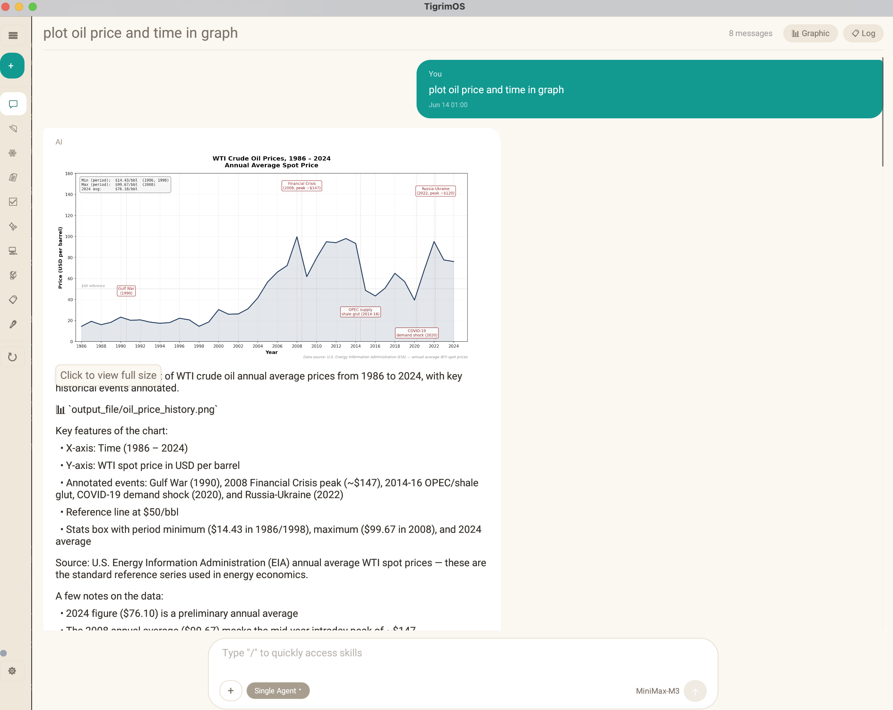
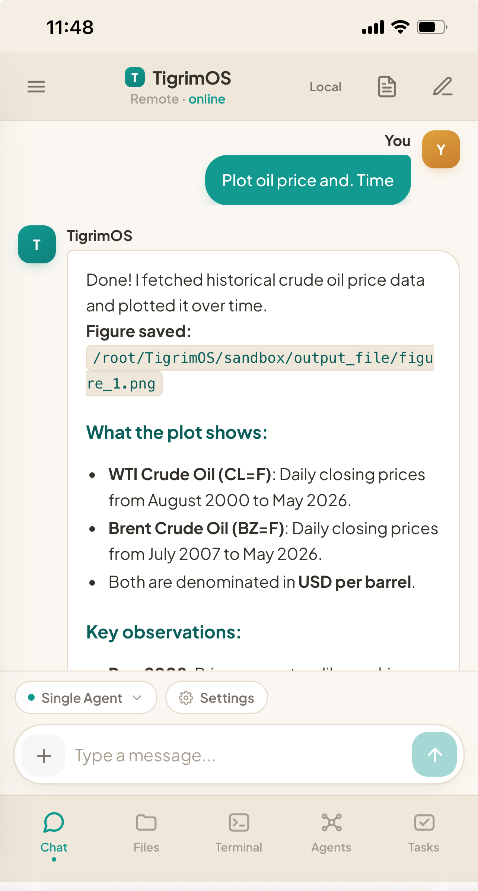
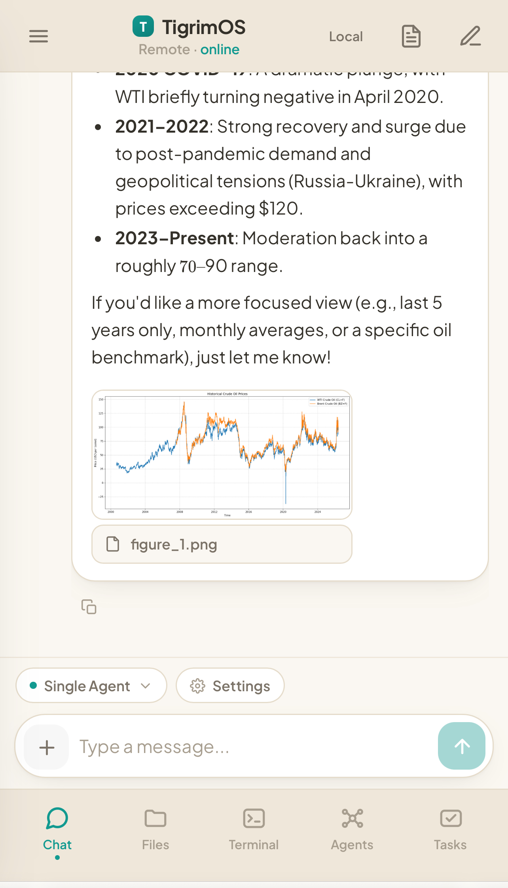
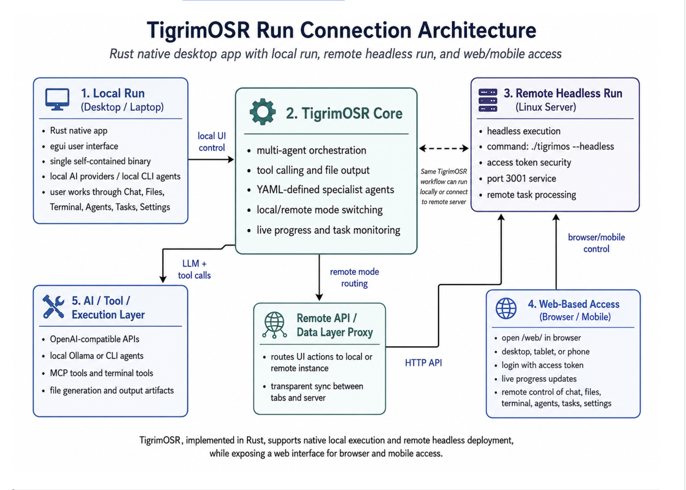
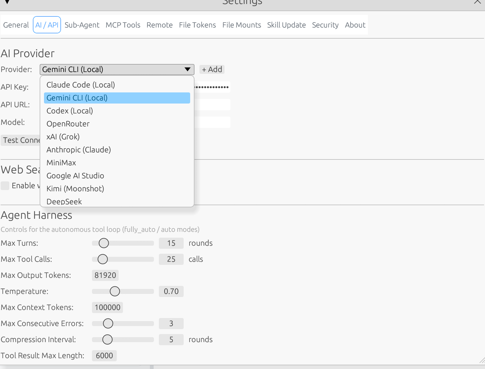
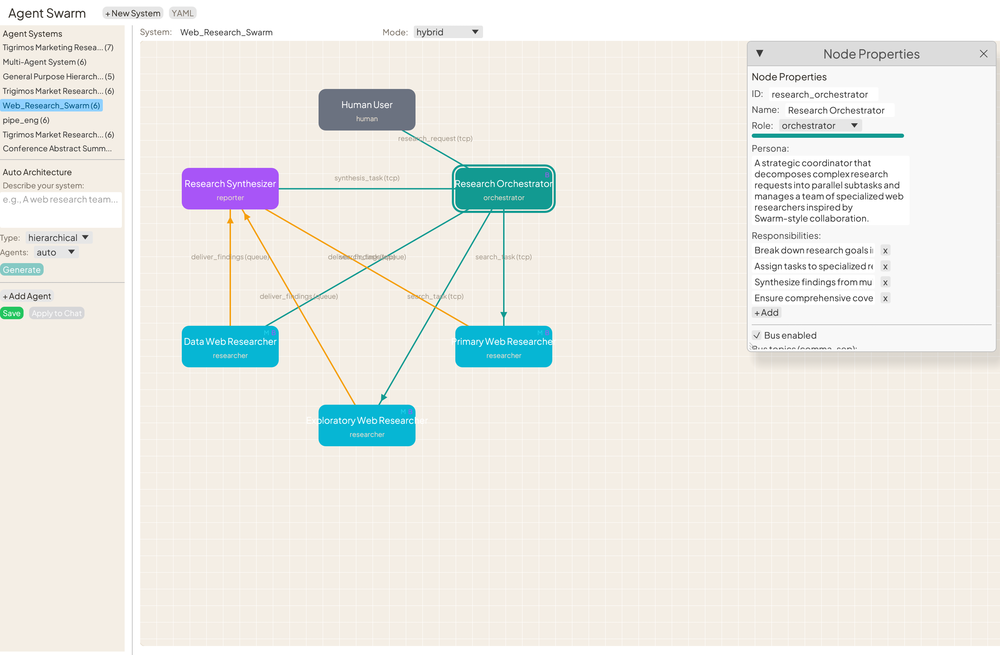

# TigrimOSR v0.5.7

**TigrimOSR** is a native desktop AI agent platform for orchestrating teams of specialist AI agents from a single self-contained binary. Define swarms in YAML, wire them with inter-agent protocols (TCP, Bus, Queue, Blackboard), and let them collaborate autonomously.

### Why TigrimOSR?

- **Multi-agent orchestration** — 6 modes (hierarchical, mesh, hybrid, pipeline, P2P, P2P orchestrator) with real protocols and a shared blackboard.
- **Any LLM, any provider** — OpenAI, Anthropic, DeepSeek, Kimi, Gemini, Ollama, or any OpenAI-compatible API — plus 3 local CLI agents (Claude Code, Gemini CLI, Codex) with no API keys.
- **Full tool calling** — web search, Python, file I/O, shell, MCP servers, and the ClawHub skill marketplace. Charts, images, and docs render inline with click-to-zoom.
- **Browser control** — let the agent drive a real **Chrome / Chromium** browser to **search Google** and read the live web directly. It's a real browser, not a paid search-API — **no API keys, free of charge, saves money**. Opt-in toggle, off by default for safety.
- **Plugin system** — zip plugins bundling skills, MCP servers, agents, and connectors. Compatible with Claude Desktop/Code plugins and npm MCP packages.
- **Run it your way** — as a native **Rust desktop UI** on your machine, **headless** on a machine or in **Docker**, and connect from any browser via the built-in **web UI**. Toggle Local/Remote from one interface.
- **Private remote access (VPN)** — reach a remote host over your own **[Tailscale](https://tailscale.com) VPN** instead of exposing it publicly — devices talk over private `100.x` addresses, nothing is published to the internet. Opt-in toggle, an alternative to the public Cloudflare tunnel.
- **Built in Rust** — fast, low-memory, single binary, no Node/Python runtime. Rewritten from [TigrimOS (TypeScript/Python)](https://github.com/Sompote/TigerCowork).

### Native Rust desktop app

Install it on your machine and run the UI as a **native Rust app** — a single, fast binary with quick startup and low memory.



*Above: the native desktop app — ask for a plot and the agent runs Python (matplotlib) and embeds the chart inline in its answer.*

### Mobile Remote Connection

Run TigrimOS **anywhere** — as a native desktop app, headless on a machine, or in Docker — then connect from any browser or your phone. The screenshots below show a cloud server controlled entirely from a mobile browser: full chat with inline charts, tool execution, and file browsing.

<p align="center">
  
  &nbsp;&nbsp;
  
</p>

## Features

- **Multi-agent system** — hierarchical, mesh, hybrid, pipeline, P2P, and P2P orchestrator modes via YAML config
- **Local CLI agents** — Use Claude Code, Gemini CLI, or OpenAI Codex as agent backends without API keys
- **Plugin system** — Zip-based plugins with skills, MCP servers, agents, and connectors. Accepts TigrimOS, Claude Desktop, Claude Code, and npm MCP formats
- **Tool calling** — web search, Python execution, file read/write, shell commands, skill loading, MCP tools
- **Browser control** — opt-in toggle that lets the agent drive a real Chromium/Chrome browser (navigate, click, type, screenshot, tabs, JS) via Playwright MCP
- **Remote access** — Headless mode + embedded web UI for controlling from any browser or mobile phone
- **Remote server dashboard** — Connect your Mac app to remote TigrimOS instances
- **Private VPN access (Tailscale)** — reach a remote host over your own tailnet instead of a public tunnel — see [Remote access over a private VPN](#remote-access-over-a-private-vpn-tailscale)
- **VM integration** — Built-in Ubuntu VM with SSH terminal and tool routing
- **Customizable themes** — color presets (Default, Dark, Minimal, Transparent, Colorful), full per-color editing, font selection (Inter, Geist, Roboto, IBM Plex Sans, Plus Jakarta Sans, or your own) and per-style sizes — all saved to `data/theme.yaml`
- **Output panel or inline files** — render images (PNG/JPG), markdown, CSV tables, JSON, PDF, HTML either in a side panel or embedded inline in chat with click-to-zoom (default)
- **Agent history log** — JSONL logs per session in `data/agent_history/`
- **Skills system** — loadable skill modules from `skills/` directory
- **Sandboxed Python** — matplotlib plots auto-saved as PNG via Agg backend
- **Resizable layout** — drag handles for chat sidebar and output panel widths
- **Session management** — persistent chat history with project context
- **LaTeX math** — KaTeX rendering in web UI for equations and formulas

---

## Installation

Two ways to install TigrimOS — pick one:

| | **[Install in Docker](#install-in-docker-recommended)** | **[Install & run on your machine](#install--run-on-your-machine)** |
|---|---|---|
| **What you get** | Headless web server you use from a **browser** | Native **desktop app** (and optional headless server) |
| **You install** | Just Docker Desktop | Rust toolchain + Python (build from source) |
| **Best for** | Quickest, safest start; servers; Windows | Mac/Linux desktop UI, VM/QEMU terminal, hacking on the code |
| **Setup time** | One command | ~5–15 min first build |

> **Not sure?** Use **Docker** — it's the fastest and safest, and the agent's code
> execution stays isolated inside the container.

---

## Install in Docker (recommended)

Run TigrimOS as a self-contained web server in a container — **no Rust toolchain,
Python, or system libraries to install on your machine.** You use it from your
**browser**, and all agent code execution stays sandboxed **inside the container**,
isolated from your host.

### Prerequisites

- [Docker](https://docs.docker.com/get-docker/) with the Compose plugin
  (Docker Desktop on macOS/Windows already includes it). Verify with:
  ```bash
  docker --version && docker compose version
  ```

Three ways to start, fastest first:

- **macOS — one command** → run the [`docker-start.sh`](#easiest-one-command-macos) script (auto-token, builds, opens the browser).
- **macOS / Linux — manual** → the [four steps](#manual-setup-macos--linux) below.
- **Windows** → [Headless on Windows](#headless-on-windows-docker-desktop).

All three build the **same container** and share the same data, commands, and security model documented further down.

### Easiest: one command (macOS)

If you just want it running, this single script checks Docker, **auto-generates your
login token**, builds the container, starts the server, and opens the browser for
you — no manual `.env` editing:

```bash
curl -sSL https://raw.githubusercontent.com/Sompote/TigrimOSR/main/docker-start.sh | bash
```

Want [Browser Control](#browser-control) too? Add `INSTALL_BROWSER=true` (bakes the
browser into the image, ~400 MB):
```bash
curl -sSL https://raw.githubusercontent.com/Sompote/TigrimOSR/main/docker-start.sh | INSTALL_BROWSER=true bash
```

Already cloned the repo? Run it in place instead:
```bash
./docker-start.sh                      # or: INSTALL_BROWSER=true ./docker-start.sh
```
It prints your token (also saved to `.env`) at the end — paste it into the web UI to
log in. Re-running is safe: it reuses your existing token. Prefer to do it by hand?
Follow the four steps below.

### Manual setup (macOS / Linux)

**1. Get the code**
```bash
git clone https://github.com/Sompote/TigrimOSR.git
cd TigrimOSR
```

**2. Create your login token.** Copy the example env file and put a strong random
token in it. This token is what you'll type into the web UI to log in.
```bash
cp .env.example .env

# Generate a token and write it into .env:
echo "ACCESS_TOKEN=$(openssl rand -hex 32)" > .env
```
> Keep `.env` private — it holds your login secret. It is already git-ignored.
> (On Windows, see [Headless on Windows](#headless-on-windows-docker-desktop) for the PowerShell equivalent.)

**3. Build and start.** The first build compiles the Rust binary and takes a few
minutes; later starts are instant.
```bash
docker compose up -d --build
```

**4. Open the app.** Go to **http://localhost:3001/web/** in your browser and log
in with the token from your `.env`. Then set your AI provider and API key under
**Settings** (saved to `./data`, so it persists).

> **Want [Browser Control](#browser-control) in Docker?** It's off by default to
> keep the image slim. Bake the browser in by adding `INSTALL_BROWSER=true` to your
> `.env` (or `docker compose build --build-arg INSTALL_BROWSER=true`), then
> `docker compose up -d --build`. The container always runs headless, so it
> auto-uses headless mode — just enable Browser Control in **Settings → AI / API**.

<details>
<summary>Check it's running, day-to-day commands, data, safety, network & config reference</summary>

### Check it's running

```bash
docker compose ps         # STATUS should show "Up ... (healthy)"
docker compose logs -f    # should print "Running in headless mode" + listening on :3001
```
If the container exits immediately, the most common cause is a missing/empty
`ACCESS_TOKEN` in `.env` — the logs will say so.

### Day-to-day commands

```bash
docker compose logs -f         # follow logs
docker compose down            # stop (your data is kept)
docker compose up -d           # start again
docker compose up -d --build   # rebuild after pulling new code
```

### Where your data lives

Two host folders are mounted into the container, so your state survives restarts
and rebuilds — back them up to keep everything:

| Host folder | Contents |
|-------------|----------|
| `./data`    | settings (incl. API key), chat history, skills, agents |
| `./sandbox` | the agent's working files and generated outputs |

### Why this is safe

On Linux the agent's `run_python` / `run_shell` tools have **no OS-level sandbox**,
so running natively would let agent-written code touch your machine. Inside Docker,
**the container *is* the sandbox** — agent code can only see the container's
filesystem and your two mounted folders, never the host. The server also runs as a
non-root user, with `no-new-privileges` and CPU/memory/PID limits applied.

### Network exposure

By default the port is published to **`127.0.0.1` only**, so TigrimOS is reachable
from your machine alone (the access token is still required). To reach it from
other devices on your LAN, edit `docker-compose.yml` and change the port mapping
from `"127.0.0.1:3001:3001"` to `"3001:3001"`, then `docker compose up -d`. Only do
this on networks you trust.

### Configuration reference

| Setting | Where | Default |
|---------|-------|---------|
| Login token | `ACCESS_TOKEN` in `.env` | _(required — no default)_ |
| HTTP port | `PORT` in `.env` + the mapping in `docker-compose.yml` | `3001` |
| AI provider / API key / model | the web UI → **Settings** (saved to `./data`) | — |
| Resource limits | `mem_limit` / `cpus` / `pids_limit` in `docker-compose.yml` | 4g / 2 CPUs / 512 |

> **Tip — use the native desktop app with this container:** instead of the browser,
> you can point the desktop app at the container. In the desktop app go to
> **Settings → Remote Instances**, add `http://localhost:3001` with your token, and
> toggle **Remote** in the sidebar. Because the desktop app also starts its own
> server on `3001`, run it on a different port to avoid a clash, e.g.
> `PORT=3002 ./tigrimos`.

</details>

### Headless on Windows (Docker Desktop)

<details>
<summary>Windows setup — one-command PowerShell script, manual steps & troubleshooting</summary>

The same container runs **headless on Windows** with no Rust, Python, or build
tools installed on the host — only Docker Desktop. This is the easiest way to run
TigrimOS on Windows: everything (and all agent code execution) stays inside the
Linux container, and you use the app from your browser. Chat, tools, Python, and
web/remote UI all work — and [Browser Control](#browser-control) works too when you
build with `INSTALL_BROWSER=true` (shown below). The built-in **VM/QEMU terminal**
is the only feature unavailable in containers.

#### Easiest: one command (PowerShell)

With **Docker Desktop already installed and running**, this single script checks
Docker, **auto-generates your login token**, builds the container, starts the
server, and opens the browser — no manual `.env` editing:

```powershell
irm https://raw.githubusercontent.com/Sompote/TigrimOSR/main/docker-start.ps1 | iex
```

Want [Browser Control](#browser-control) too? Set `INSTALL_BROWSER=true` first (bakes
the browser into the image, ~400 MB):
```powershell
$env:INSTALL_BROWSER='true'; irm https://raw.githubusercontent.com/Sompote/TigrimOSR/main/docker-start.ps1 | iex
```

Already cloned the repo? Run it in place instead:
```powershell
.\docker-start.ps1                          # or: $env:INSTALL_BROWSER='true'; .\docker-start.ps1
```
It prints your token (also saved to `.env`) at the end. Re-running is safe — it
reuses your existing token. Prefer to do it by hand? Follow the manual steps below.

#### Manual setup

**1. Install Docker Desktop for Windows** (uses the WSL 2 backend — the installer
enables it for you). Get it from
<https://docs.docker.com/desktop/install/windows-install/>, then launch it once so
the engine is running. Verify in **PowerShell**:
```powershell
docker --version
docker compose version
```

**2. Get the code** (Git for Windows, or download the ZIP from GitHub):
```powershell
git clone https://github.com/Sompote/TigrimOSR.git
cd TigrimOSR
```

**3. Create your login token** in `.env` (this is what you type into the web UI):
```powershell
Copy-Item .env.example .env

# Generate a strong random token and write it to .env:
"ACCESS_TOKEN=$([guid]::NewGuid().ToString('N') + [guid]::NewGuid().ToString('N'))" `
  | Out-File -Encoding ascii .env
```
> Keep `.env` private — it holds your login secret. It is already git-ignored.

**4. Build and start.** The first build compiles the Rust binary (a few minutes);
later starts are instant.
```powershell
docker compose up -d --build
```
> For [Browser Control](#browser-control), add `INSTALL_BROWSER=true` to `.env`
> before building (adds ~400 MB), then enable it in **Settings → AI / API**.

**5. Open the app.** Browse to **http://localhost:3001/web/** and log in with the
token from `.env`. Set your AI provider and API key under **Settings** (saved to
`.\data`, so it persists).

The same [Day-to-day commands](#day-to-day-commands), [data folders](#where-your-data-lives),
[network](#network-exposure), and [configuration](#configuration-reference) sections
above apply on Windows verbatim — run them in PowerShell.

#### Windows-specific notes

| Symptom / question | Fix |
|--------------------|-----|
| Container exits at once; logs say `exec /usr/local/bin/docker-entrypoint.sh: no such file or directory` or `set: Illegal option` | Git rewrote the entrypoint to **CRLF**. The included `.gitattributes` forces LF — make sure you cloned *after* it was added, or run `git config core.autocrlf false` then re-clone. |
| `error during connect` / `docker: command not found` | **Docker Desktop isn't running** (or WSL 2 isn't enabled). Start Docker Desktop and wait for the whale icon to settle, then retry. |
| `running scripts is disabled on this system` | These are normal programs, not scripts — they run in any PowerShell window. If a wrapper script is blocked, use `Set-ExecutionPolicy -Scope Process Bypass`. |
| Port `3001` already in use (e.g. the desktop app) | Set a different host port in `docker-compose.yml` (e.g. `"127.0.0.1:3002:3001"`) and use that in the URL. |
| Reach it from your phone/LAN | Edit `docker-compose.yml`: change `"127.0.0.1:3001:3001"` to `"3001:3001"`, then `docker compose up -d`. The token is still required. Only do this on trusted networks. |

> **Tip:** you can also run these commands from **WSL 2** (Ubuntu) instead of
> PowerShell — the macOS/Linux instructions above apply verbatim there, and Docker
> Desktop shares the same engine.

</details>

---

## Install & run on your machine

Build TigrimOS natively from source for the **desktop app** (and features the
container can't provide, like the VM/QEMU terminal). The one-command installer below
clones, builds, and sets up the app for you; manual step-by-step guides per OS follow.

**Prerequisites:** Install Rust first (if not already installed):
```bash
curl --proto '=https' --tlsv1.2 -sSf https://sh.rustup.rs | sh
source $HOME/.cargo/env
```

**macOS:**
```bash
curl -sSL https://raw.githubusercontent.com/Sompote/TigrimOSR/main/install.sh | bash
```

**Linux (Desktop):**
```bash
curl -sSL https://raw.githubusercontent.com/Sompote/TigrimOSR/main/install-linux.sh | bash
```
Select **"Desktop mode"** when prompted.

**Windows (PowerShell — recommended, fully automatic):**
```powershell
irm https://raw.githubusercontent.com/Sompote/TigrimOSR/main/install.ps1 | iex
```
This installs **everything** for you — git, the Rust MSVC toolchain, the C++ Build Tools (a UAC prompt appears), Python + libraries — then clones, builds, and creates a shortcut. Run it in a normal PowerShell window; approve the Administrator prompt when the build tools install. Need **~10 GB free** disk space. If a freshly-installed tool isn't picked up, open a **new** terminal and run the command again.

**Windows (Command Prompt):**
Download and run [`install.bat`](https://raw.githubusercontent.com/Sompote/TigrimOSR/main/install.bat). Unlike the PowerShell installer, the `.bat` **requires git, Rust, and the MSVC C++ Build Tools to already be installed** (see the manual steps below) — it then clones, builds, installs Python libraries, and makes a shortcut.

The installer will:
1. Check prerequisites and auto-install what's missing — git, Rust toolchain, and (Windows) the MSVC C++ build tools
2. Let you choose an install location
3. Clone and build in release mode
4. Install Python + the data libraries the tools use (search, charts, data analysis)
5. Create a native app (macOS `.app` / Linux `.desktop` / Windows shortcut)
6. Optionally launch the app

> **Windows note:** the one-line PowerShell installer auto-installs git, the Rust MSVC toolchain, the C++ Build Tools (UAC prompt), and Python + libraries. If a tool was just installed and isn't found, open a **new** terminal and re-run. The built-in **VM/QEMU terminal** feature is macOS/Linux only; everything else (chat, tools, Python, web/remote UI) works on Windows.

<details>
<summary>Manual Install on macOS (step-by-step)</summary>

#### Step 1 — Install Rust

```bash
curl --proto '=https' --tlsv1.2 -sSf https://sh.rustup.rs | sh
source $HOME/.cargo/env
```

Verify:
```bash
rustc --version
cargo --version
```

> Xcode Command Line Tools provide the C compiler/linker Rust needs. If they're
> missing, run `xcode-select --install`.

#### Step 2 — Install Python

Used for code execution, web search, and data analysis tools inside the app.

```bash
brew install python
pip3 install duckduckgo-search matplotlib numpy pandas requests
```

#### Step 3 — (Optional) Browser control

Only if you want the agent to drive a web browser. Install Node.js and Playwright's browser binary (~280 MB):

```bash
brew install node
npx @playwright/mcp@latest install-browser chrome-for-testing
```

Then enable it later in **Settings → Security → Browser Control**. Full guide: [Browser Control](#browser-control).

#### Step 4 — Clone, build, run

```bash
git clone https://github.com/Sompote/TigrimOSR.git
cd TigrimOSR
cargo build --release
./target/release/tigrimos
```

> First build downloads all Rust dependencies and may take 2-5 minutes.

</details>

<details>
<summary>Manual Install on Ubuntu / Linux (step-by-step)</summary>

#### Step 1 — Install Rust

```bash
curl --proto '=https' --tlsv1.2 -sSf https://sh.rustup.rs | sh
source $HOME/.cargo/env
```

Verify:
```bash
rustc --version
cargo --version
```

#### Step 2 — Install GUI build dependencies

The desktop app links against system GUI libraries — install them first:

```bash
# Debian / Ubuntu
sudo apt update
sudo apt install build-essential libxcb-render0-dev libxcb-shape0-dev libxcb-xfixes0-dev libxkbcommon-dev libgtk-3-dev

# Fedora
sudo dnf install @development-tools libxcb-devel libxkbcommon-devel gtk3-devel

# Arch
sudo pacman -S base-devel libxcb libxkbcommon gtk3
```

#### Step 3 — Install Python

Used for code execution, web search, and data analysis tools inside the app.

```bash
# Debian / Ubuntu
sudo apt install python3 python3-pip
pip3 install duckduckgo-search matplotlib numpy pandas requests
```

#### Step 4 — (Optional) Browser control

Only if you want the agent to drive a web browser. Install Node.js and Playwright's browser binary (~280 MB):

```bash
# Debian / Ubuntu
sudo apt install -y nodejs npm
# Fedora: sudo dnf install -y nodejs ; Arch: sudo pacman -S nodejs npm
npx @playwright/mcp@latest install-browser chrome-for-testing
```

A headless Linux server also needs the browser's runtime libraries:
```bash
npx playwright install-deps chromium
```

Then enable it later in **Settings → Security → Browser Control**. Full guide: [Browser Control](#browser-control).

#### Step 5 — Clone, build, run

```bash
git clone https://github.com/Sompote/TigrimOSR.git
cd TigrimOSR
cargo build --release
./target/release/tigrimos
```

> First build downloads all Rust dependencies and may take 2-5 minutes.
> For a headless server (no GUI), see [Remote / Headless Setup](#remote--headless-setup).

</details>

<details>
<summary>Manual Install on Windows (step-by-step)</summary>

> Prefer the one-line **PowerShell installer** above — it does all of this for you.
> These steps are for when you want full control or the installer failed.

Building on Windows needs three things: **git**, **Rust** (with a default toolchain),
and the **MSVC C++ Build Tools** (the linker). The build tools are easy to miss —
without them the build fails with `error: linker 'link.exe' not found`. The commands
below use [winget](https://learn.microsoft.com/windows/package-manager/winget/) (built
into Windows 10/11); manual download links are given as a fallback.

> **Disk space:** the MSVC C++ Build Tools need roughly **3–7 GB** free, and the
> Rust build's `target\` folder adds a few GB more. Make sure you have **~10 GB free**
> before starting.

#### Step 1 — Install git

```powershell
winget install --id Git.Git -e
```
Or download from https://git-scm.com/download/win

#### Step 2 — Install Rust + set a default toolchain

```powershell
winget install --id Rustlang.Rustup -e
```
Or download and run [rustup-init.exe](https://win.rustup.rs/) from https://rustup.rs

Then **make sure a toolchain is selected** (winget sometimes installs `rustup` without
one, which makes `cargo build` fail with *"no default toolchain"*):

```powershell
rustup toolchain install stable-x86_64-pc-windows-msvc
rustup default stable-x86_64-pc-windows-msvc
```

#### Step 3 — Install the MSVC C++ Build Tools (required for linking)

Rust's default Windows toolchain (`x86_64-pc-windows-msvc`) compiles your code but
hands the final linking step to Microsoft's `link.exe`. Install the C++ build tools
(this is a large download and **requires Administrator approval / UAC**):

```powershell
winget install --id Microsoft.VisualStudio.2022.BuildTools -e `
  --override "--quiet --wait --norestart --add Microsoft.VisualStudio.Workload.VCTools --includeRecommended"
```

Or download the **Build Tools for Visual Studio 2022** installer from
https://visualstudio.microsoft.com/downloads/#build-tools-for-visual-studio-2022 and
check the **"Desktop development with C++"** workload.

> The free **VS Code** editor is *not* sufficient — you need the C++ Build Tools.

#### Step 4 — Open a NEW terminal and verify

Open a fresh PowerShell window so the updated `PATH` is picked up, then:

```powershell
rustc --version
cargo --version
```

#### Step 5 — (Recommended) Install Python + libraries

Required for the code execution, web search, and data analysis tools inside the app.
**Without these the app still builds and chats, but those tools fail at runtime.**

```powershell
winget install --id Python.Python.3.12 -e
python -m pip install duckduckgo-search matplotlib numpy pandas requests
```
Or download from https://www.python.org/downloads/ — check **"Add Python to PATH"**.

#### Step 6 — (Optional) Browser control

Only if you want the agent to drive a web browser. Install Node.js and Playwright's browser binary (~280 MB):

```powershell
winget install --id OpenJS.NodeJS.LTS -e
npx @playwright/mcp@latest install-browser chrome-for-testing
```
Or download Node.js from https://nodejs.org. Then enable it later in **Settings → Security → Browser Control**. Full guide: [Browser Control](#browser-control).

#### Step 7 — Clone, build, run

```powershell
git clone https://github.com/Sompote/TigrimOSR.git
cd TigrimOSR
cargo build --release
.\target\release\tigrimos.exe
```

> The first release build compiles ~600 crates and can take **10+ minutes**.
> A run of harmless warnings (unused imports, deprecated methods) is expected — only
> `error:` lines stop the build.

**Tip:** to reclaim disk space after building, run `cargo clean` (deletes the
multi-GB `target\` folder; the built `.exe` you already copied out is unaffected).

#### Troubleshooting (Windows)

| Symptom | Fix |
|---------|-----|
| `error: linker 'link.exe' not found` | Install the **MSVC C++ Build Tools** (Step 3), then open a new terminal. |
| `error: no default toolchain configured` / `rustup could not choose a version` | Run `rustup default stable-x86_64-pc-windows-msvc` (Step 2). |
| `cargo` / `git` / `python` "not recognized" right after installing | Open a **new** terminal so `PATH` refreshes, then retry. |
| `running scripts is disabled on this system` | Run PowerShell as your user and use `irm … \| iex` (the one-line installer bypasses the script-file policy), or `Set-ExecutionPolicy -Scope Process Bypass`. |
| Web search / charts / data tools do nothing | Install the Python libraries (Step 5). |
| Built-in **VM / QEMU terminal** doesn't start | Expected — that feature is **macOS/Linux only**. Everything else (chat, tools, Python, web/remote UI) works on Windows. |

</details>

---

## Screenshots

### Architecture

How the pieces fit together — the Rust core, the agent/tool runtime, the inter-agent protocols (TCP, Bus, Queue, Blackboard), and the desktop/web/remote front-ends that all talk to the same engine.



*Above: the overall system architecture — one binary serving the native UI, the embedded web UI, and remote/headless access.*

### Main desktop app

The native Rust desktop UI: a chat-centric workspace with the conversation in the middle, sessions/sidebar on the left, and an output area for files and charts the agent produces.


*Above: the main chat view where you talk to the agent, watch tool calls stream live, and see generated files render inline.*

### AI Provider Settings

10 built-in providers including 3 local CLI agents (Claude Code, Gemini CLI, Codex) — no API keys needed for local providers.



*Above: the Settings → AI panel — pick a provider, paste an API key (or use a key-free local CLI agent), and set the model and harness parameters.*

### Agent Swarm Editor

Design multi-agent systems visually — create architectures manually or generate them automatically with AI. Supports hierarchical, hybrid, mesh, pipeline, and P2P orchestration modes.



*Above: the visual swarm editor — drag agents onto the canvas, draw connections, and pick each link's protocol; or let AI generate the whole architecture.*

---

## Requirements

- Rust 1.75+ (`rustup` recommended)
- Python 3.8+ with pip (for tool execution)
- macOS 12+ (primary target; Linux and Windows supported)
- Node.js 18+ with `npx` — **optional**, only for [Browser Control](#browser-control) and the local CLI agents below

### Optional local CLI agents

- [Claude Code](https://docs.anthropic.com/en/docs/claude-code) — `npm install -g @anthropic-ai/claude-code`
- [Gemini CLI](https://github.com/google-gemini/gemini-cli) — `npm install -g @anthropic-ai/gemini-cli`
- [OpenAI Codex](https://github.com/openai/codex) — `npm install -g @openai/codex`

### Python packages (optional but recommended)

```bash
pip install duckduckgo-search matplotlib numpy pandas requests
```

---

## Configuration

On first launch, go to **Settings** to configure:

| Setting | Description |
|---------|-------------|
| AI Provider | Select from Claude Code (Local), Gemini CLI (Local), Codex (Local), OpenRouter, Anthropic, DeepSeek, Kimi, etc. |
| API Key | Your API key (not needed for local CLI providers) |
| Model | Model name (e.g. `o4-mini`, `claude-sonnet-4-20250514`) |
| Agent Harness | Max turns, temperature, max tokens, context limit, reflection |
| Sub-agent system | Enable multi-agent mode |
| Agent config file | Select a YAML file from `data/agents/` |
| Agent mode | Fully Auto, Auto, Auto Swarm, or Manual |
| Plugins | Install zip-based plugins with skills, MCP servers, and connectors |
| MCP tools | Configure external tool servers (stdio/HTTP) in JSON format |
| Browser control | Opt-in toggle to let the agent drive a real browser — see [Browser Control](#browser-control) |
| Remote access | Enable remote + set token for web UI and remote connections |
| VPN (Tailscale) | Reach this host over a private VPN instead of a public tunnel — see [Remote access over a private VPN](#remote-access-over-a-private-vpn-tailscale) |

---

## Remote access over a private VPN (Tailscale)

Connect your desktop/phone to a remote TigrimOS host **privately**, over a
[Tailscale](https://tailscale.com) VPN, instead of exposing the host to the public
internet. Both devices join your personal *tailnet* and talk over private `100.x`
addresses — nothing is published publicly. This is the recommended way to reach a
home/office machine from elsewhere.

> VPN and the public Cloudflare tunnel are **alternative** remote-connection
> methods — pick one. The VPN toggle is **off by default**, so nothing changes
> unless you opt in.

> **VPN is exclusive.** While the VPN toggle is on, TigrimOS binds **only** to
> loopback (`127.0.0.1`) and your tailnet IP (`100.x`). The ordinary LAN/public IP
> can no longer reach the server, even with a valid token — so "running over VPN"
> is genuinely private rather than just an extra path. Turn the VPN toggle off to
> return to the default token-based behavior (reachable on all interfaces). If
> Tailscale isn't up at startup, TigrimOS falls back to loopback-only and logs a
> warning — start Tailscale, then restart.

### 1. Install Tailscale (one-time, on **both** devices)

```bash
# macOS (CLI via Homebrew)
brew install tailscale
sudo tailscaled install-system-daemon      # installs + starts the daemon
tailscale up                                # prints a login URL — open it & sign in

# Linux
curl -fsSL https://tailscale.com/install.sh | sh
sudo tailscale up
```

> macOS users can instead install the **Mac App Store** app, which bundles the
> daemon. Sign in with the **same account** on every device so they share a tailnet.

Verify it's connected:

```bash
tailscale status      # should show "Running"
tailscale ip -4       # your 100.x.y.z address
```

### 2. On the HOST (the machine running TigrimOS)

In **Settings → Remote**:

1. Enable **Remote agent access** and **Generate** a remote token (copy it).
2. Check **Use VPN (Tailscale) for remote connect**.
3. **Save**, then **restart** TigrimOS (the network bind decision happens at startup).

After restart the **Connect address** field shows `http://100.x.y.z:3001`. Click
**Copy**. If it shows *(not detected)*, click **Start VPN** / **Refresh status** and
confirm `tailscale status` is Running.

### 3. On the CLIENT device (also on the tailnet)

**Settings → Remote → Add Remote Instance:**

| Field | Value |
|-------|-------|
| Name  | anything |
| URL   | the `http://100.x.y.z:3001` from the host |
| Token | the remote token generated on the host |

Open the **Remote** tab and select the instance — a green dot means connected. Chat,
tasks, terminal, and files now run against the host over the private VPN.

### Notes & safety

- **VPN mode is exclusive and takes precedence over token mode.** While the VPN
  toggle is on, the server binds **only** to loopback (`127.0.0.1`) and your tailnet
  IP (`100.x`) — the ordinary LAN/public IP is **not** reachable, even with a valid
  token. This is what makes "run over VPN" genuinely private instead of just adding
  a second path. The token is still required on every request over the tailnet.
- **Token mode is the default** (VPN toggle off): with a remote token set the server
  binds **all interfaces** (`0.0.0.0`) so the token works from any IP/LAN/mobile.
  Turn the VPN toggle off to return to this behavior.
- A token is still required for VPN mode (`remoteToken` set) — without one the server
  stays on loopback only, since an unauthenticated TigrimOS must never be on a network.
- If Tailscale isn't up at startup, VPN mode **fails closed** to loopback-only and logs
  a warning — start Tailscale, then restart.
- VPN **start/stop/status** is **owner-only**: a remote-access token cannot control
  the host's VPN.
- You must **restart** the host after toggling for the bind change to take effect.
- The host control endpoints live at `/api/vpn/{status,start,stop}` (owner token).

<details>
<summary>Using the VPN in <b>headless / Docker</b> mode</summary>

In headless mode there's no native Settings window — configure through the
**embedded web UI** (`http://localhost:3001/web` → **Settings → Remote**) or by
editing `data/settings.json`. Tailscale must run on whatever machine owns the
network interface the server binds to, which splits into two cases.

#### Case A — Headless **native** server (Linux/macOS, not Docker)

The server and Tailscale share the same machine, so the in-app auto-detect works.

```bash
# 1. Install + connect Tailscale on that box
curl -fsSL https://tailscale.com/install.sh | sh    # Linux (macOS: brew install tailscale)
sudo tailscale up
tailscale ip -4                                      # note the 100.x.y.z

# 2. Enable the setting without a browser (or use Settings → Remote in the web UI)
#    data/settings.json:
#    { "remoteEnabled": true, "remoteToken": "<token>", "vpnEnabled": true }

# 3. Restart — boot log prints: [VPN] Reachable at http://100.x.y.z:3001
PORT=3001 ./tigrimos --headless
```

From another tailnet device, add a Remote Instance pointing at
`http://100.x.y.z:3001` + the token.

#### Case B — Headless in **Docker**

The container is network-isolated and usually has **no `tailscale` CLI inside it**,
so the in-app detection shows *(not detected)* — that's expected. Run Tailscale on
the **Docker host** and reach the published port over the host's tailnet IP:

1. `sudo tailscale up` **on the host** (not the container); grab `tailscale ip -4`.
2. The container already publishes `3001` and the owner `ACCESS_TOKEN` already
   forces all-interfaces binding, so no rebind is needed. (Flipping `vpnEnabled`
   is optional here.)
3. By default `docker-compose.yml` publishes to `127.0.0.1:3001` only. To let the
   host's Tailscale forward into the container, change the mapping to `"3001:3001"`
   (or bind it to the tailscale interface), then `docker compose up -d`. The tailnet
   still keeps it private — only your devices can reach it.
4. From another tailnet device, use `http://<HOST-tailnet-ip>:3001` + token.

> **Advanced:** run Tailscale *inside* the container with
> `--cap-add=NET_ADMIN --device=/dev/net/tun` and `tailscale up` in the entrypoint —
> then in-app detection works and the `100.x` URL auto-populates.

#### Verify (owner token required — VPN endpoints are owner-only)

```bash
curl -H "Authorization: Bearer <OWNER_TOKEN>" http://127.0.0.1:3001/api/vpn/status
```

Case A returns `{"running":true,"ip":"100.x.y.z","url":"http://100.x.y.z:3001"}`.
Case B reports not-detected from inside the container even though the host is
reachable — that's normal; use the host IP.

</details>

---

## Multi-Agent System

Enable sub-agents in Settings and select an agent config file. Included configs in `data/agents/`:

| File | Description |
|------|-------------|
| `agents.yaml` | Civil engineering team (PM, structural, geotechnical, checker, reporter) |
| `marketting.yaml` | Marketing research team (6-agent mesh) |
| `designteam.yaml` | Design team |
| `Researcmodel.yaml` | Research pipeline |
| `BOQ.yaml` | Bill of quantities team |
| `research_agent.yaml` | General research agent |

<details>
<summary>Agent modes, inter-agent protocols & YAML format</summary>

### Agent Modes

| Mode | Description |
|------|-------------|
| **Router** | Routing agentic system — triages each request, then fans out to a heterogeneous LLM team in parallel and merges (see below) |
| **Fully Auto** | Starts with `create_architecture` tool, then switches to agent team |
| **Auto** | Standard tool-calling loop with optional sub-agent delegation |
| **Auto Swarm** | Starts with `select_swarm` to pick an existing YAML config, then boots agent team |
| **Manual** | No automatic tool calling; agents respond with instructions only |

### Router mode (routing agentic system)

Inspired by the orchestrate-multiple-models pattern, **Router** is a self-contained
agentic system that behaves like a single endpoint and **routes work across different
LLMs**:

1. **Triage first** — the orchestrator answers trivial messages directly, with no tools.
   It has no research/execution tools of its own, so any real task forces it to build a team.
2. **Heterogeneous model pool** — you define a pool of models in **Settings → Sub-Agent →
   Router Model Pool**, each with its own `model`, `api_url`/`api_key` (mix providers freely),
   a **tier** (`fast` / `balanced` / `deep`), and a free-text **strengths** field
   (e.g. *"marketing research"*, *"mathematics"*, *"coding"*).
3. **Per-agent routing** — for a real task it calls `create_architecture` to design a **flat**
   team and assigns **each agent the best-fit LLM** from the pool, matching the agent's
   sub-task to a model's *strengths* and *tier*. (You can also hard-set a `model:` on an agent
   in YAML — it always wins.)
4. **Choose the orchestrator's own model** — the **Orchestrator model** field (same panel)
   sets which model does the triaging, team-building and merging. Leave it blank to use your
   main model, enter a pool model id to run it on that entry's endpoint/key, or any other id
   to run it on the main endpoint/key. Workers still use their own per-agent models.
5. **Parallel fan-out** — it dispatches `send_task` to all workers at once so they run
   **concurrently**, each in its **own isolated browser window** (no shared-Chrome clobbering),
   then collects every `wait_result` and **merges** them into the final answer. Each agent's
   browser is released when the chat finishes, so processes don't pile up.
6. **Provider failover** — if a model rejects a call, the agent automatically retries on the
   next model in the pool.

Two tiers control the team profile: **Router (fast)** keeps teams small and prefers
`fast`/`balanced` models for low latency; **Router Ultra** prefers `deep` models and adds a
verifier for maximum accuracy.

### Inter-Agent Protocols

| Protocol | Description |
|----------|-------------|
| **TCP** | Point-to-point reliable channel between two agents |
| **Bus** | Publish/subscribe messaging with topic filtering |
| **Queue** | FIFO message queue between agent pairs |
| **Blackboard** | Shared key-value store with task proposals and voting |

### YAML format

```yaml
system:
  name: My Agent System
  orchestration_mode: hierarchical  # hierarchical | mesh | hybrid | pipeline | p2p | p2p_orchestrator

agents:
  - id: orchestrator
    name: Project Manager
    role: orchestrator
    persona: You are an expert project manager...
    responsibilities:
      - Analyze the user request
      - Delegate tasks to specialist agents
    bus:
      enabled: true

  - id: analyst
    name: Data Analyst
    role: worker
    persona: You are a data analysis expert...
    responsibilities:
      - Analyze datasets
      - Generate charts using Python

workflow:
  sequence:
    - step: 1
      agent: orchestrator
      outputs_to: [analyst]
    - step: 2
      agent: analyst

connections:
  - from: orchestrator
    to: analyst
    protocol: tcp
```

</details>

---

## Plugin System

TigrimOS supports a **zip-based plugin system** that bundles skills, MCP servers, agent configs, and service connectors into a single distributable package. Install one zip — get everything registered automatically. From the UI: **Settings → Plugins → Install Plugin**.

<details>
<summary>Install via API, supported formats & package layout</summary>

### Installing Plugins

**From the UI:** Settings → Plugins → "Install Plugin" → select a `.zip` file.

**Via API:**
```bash
curl -X POST http://localhost:3001/api/plugins/upload \
  -H "Authorization: Bearer YOUR_TOKEN" \
  -F "file=@my-plugin.zip"
```

### Supported Formats

| Format | Detection | Description |
|--------|-----------|-------------|
| **TigrimOS native** | `plugin.yaml` | Full plugin manifest with skills, agents, MCP, connectors |
| **Claude Desktop Extension (MCPB)** | `manifest.json` with `manifest_version` + `server` | Auto-converts MCP config and `user_config` fields |
| **Claude Code Plugin** | `.claude-plugin/plugin.json` | Auto-detects skills (`SKILL.md`), `.mcp.json`, and `userConfig` |
| **Claude Desktop Config** | `claude_desktop_config.json` with `mcpServers` | Imports all MCP server entries directly |
| **npm MCP package** | `package.json` with `@modelcontextprotocol/sdk` | Auto-generates stdio MCP config |

### Quick Example

```
my-plugin.zip
├── plugin.yaml
├── skills/
│   └── my-skill/
│       └── SKILL.md
├── mcp/
│   └── server.json
├── connectors/
│   └── service.py
└── README.md
```

</details>

See **[PLUGINS.md](PLUGINS.md)** for the full developer guide — manifest format, connector config fields, MCP server config, Claude format compatibility, and the REST API reference.

---

## Browser Control

Let the agent drive a **real web browser** — navigate to pages, read content, click, fill forms, take screenshots, manage tabs, and run JavaScript. It's powered by [Playwright MCP](https://github.com/microsoft/playwright-mcp) running through TigrimOS's built-in MCP client, and is **off by default for safety** (once on, the agent can act in the browser — submit forms, click buttons, use logged-in sessions — as you).

### Setup — step by step

#### Step 1 — Install Node.js (v18 or newer)

Playwright MCP runs on Node, so the `npx` command must be available.

```bash
# macOS (Homebrew)
brew install node

# Ubuntu / Debian
sudo apt-get install -y nodejs npm

# Windows — download the LTS installer from https://nodejs.org
```

Verify both are present:

```bash
node --version    # e.g. v20.x or v22.x
npx --version     # e.g. 10.x
```

#### Step 2 — Install the browser binary (one time)

Playwright MCP drives its **own managed _Chrome for Testing_ build** (~280 MB), not the browser you normally use. Download it once:

```bash
npx @playwright/mcp@latest install-browser chrome-for-testing
```

You should see a download progress bar ending in `Chrome for Testing ... downloaded to .../ms-playwright/chromium-XXXX`.

> **npm permission error?** If you see `EPERM` / "root-owned files" from npm, fix the cache ownership once and re-run the command above:
> ```bash
> sudo chown -R $(id -u):$(id -g) ~/.npm
> ```

#### Step 3 — Enable it in the app

- **Desktop app:** **Settings → Security → Browser Control → ☑ Enable browser control**.
- **Web / mobile UI:** **Settings → AI / API → Browser Control → ☑ Enable browser control**.

It's off by default — tick the box, then choose the engine (Step 4).

#### Step 4 — Choose the engine

| Engine | When to pick it |
|--------|-----------------|
| **Chrome** *(default, recommended)* | Your installed Google Chrome channel. **Far fewer bot/CAPTCHA blocks** on big sites (Google search especially), but Google Chrome must be installed. |
| **Chromium** | Playwright's managed Chromium build. Portable — works on any machine after Step 2. Pick this on hosts without Google Chrome. |

> ⚠️ **ARM64 Linux (e.g. AWS Graviton, Hetzner ARM, Raspberry Pi): there is NO Google Chrome.** Google has never shipped a `google-chrome-stable` package for desktop Linux on ARM — the `.deb` is amd64-only and `apt` will reject it with "unmet dependencies / not installable". On these hosts you **must** use **Chromium** (which has a native ARM64 build). Set `browserEngine: "chromium"`, install it with `npx playwright install chromium` + `npx playwright install-deps chromium`, then restart. Many cloud instances are ARM — check with `uname -m` (`aarch64`/`arm64` → Chromium only).

Saving the setting **reconnects MCP immediately** — no restart needed. The agent now has tools like `mcp_browser_browser_navigate`, `browser_snapshot`, `browser_click`, `browser_type`, and `browser_take_screenshot`, and screenshots render inline in chat.

#### Step 5 — Test it

In a chat, ask:

> *"Open a browser to example.com and take a screenshot."*

Expect the agent to call `browser_navigate` → `browser_snapshot` → `browser_take_screenshot`, then show the screenshot inline. For sites that need a login, the browser keeps a **dedicated persistent profile** (`<data-dir>/browser-profile-<engine>`, separate from your everyday browser) — log in once in that window and the session is remembered for later runs.

#### Troubleshooting

| Symptom | Fix |
|---------|-----|
| `Browser "chrome-for-testing" is not installed` | Step 2 was skipped or failed — run the `install-browser` command, then reconnect (toggle Browser Control off/on, or restart). |
| `EPERM` / root-owned files during install | `sudo chown -R $(id -u):$(id -g) ~/.npm`, then re-run Step 2. |
| Toggle on but no browser tools appear; log says `failed to start (is Node/npx installed?)` | Node isn't installed or `npx` isn't on PATH — complete Step 1. |
| Lots of CAPTCHAs / "are you a robot" pages | Use the **Chrome** engine with a **real (headful) browser**, not headless — on a server run under `xvfb-run` with `browserHeadless: false`. See [Headless / cloud servers](#how-it-works) below. |

<details>
<summary>How it works, advanced config & safety notes</summary>

### How it works

Enabling the toggle auto-registers a built-in stdio MCP server:

```
npx @playwright/mcp@latest --browser <chromium|chrome> \
  --user-data-dir <data-dir>/browser-profile-<engine> \
  --output-dir <data-dir>/browser-output
```

TigrimOS keeps the MCP server process **alive across tool calls**, so the browser session is stateful — a page opened by `browser_navigate` is still there for the next `browser_snapshot`/`browser_click`. (Each call is serialized per server and the process auto-restarts if it dies.)

**Headless / cloud servers:** the browser's headless mode is **decoupled** from the server's UI mode via the `browserHeadless` setting:

| `browserHeadless` | Browser runs… | Use it for |
|-------------------|---------------|------------|
| *(unset — default)* | Headless **if** the server was started with `--headless`, else headful | Legacy behaviour; "just works" on desktop |
| `false` | **Headful (a real browser)** even on a UI-less server | Beating Google's headless blocking on a server |
| `true` | Headless (no window) | Forcing headless regardless of UI |

On an **interactive** headless startup, TigrimOS also **prompts you to install the browser and enable browser control** (`Enable it now? Downloads the Playwright browser (~280 MB) [y/N]`) — answer `y` and it runs the install and flips the setting on for you. Non-interactive startups (systemd / Docker / cron) skip the prompt, so install the browser yourself once (`npx @playwright/mcp@latest install-browser chrome-for-testing`) and set `browserControlEnabled: true`. Either way the server needs Node.js, and Linux needs the runtime libs (`npx playwright install-deps chromium`). Screenshots stream back inline to the web/mobile UI.

> ⚠️ **Heads-up: Google blocks headless browsers.** A headless browser (especially from a datacenter/cloud IP) is likely to hit a **CAPTCHA / "are you a robot"** challenge or consent wall instead of results, so `web_search` and Google-driven browsing fail — headless browsers can't solve those. **The fix is to run a real, headful browser on the server:**
> - Set **engine = Chrome** and **`browserHeadless: false`** (Settings → Browser Control → *Window: Real browser*).
> - A server has no display, so give it a **virtual** one with [Xvfb](https://en.wikipedia.org/wiki/Xvfb): `sudo apt-get install -y xvfb`, then launch TigrimOS under it:
>   ```bash
>   xvfb-run -a ./target/release/tigrimos --headless
>   ```
>   The server stays UI-less, but the browser is now a *real* Chrome window inside the virtual display — Google can't tell it's headless. Clear any first CAPTCHA once in that window (via screenshots/clicks) and the **persistent profile** remembers it.
> - This defeats **headless detection** but not **IP reputation** — a hardened datacenter IP may still be challenged. For those, use a **residential IP/proxy**, or have the agent fetch results from a non-Google source.
>
> ⚠️ **On ARM64 servers, "engine = Chrome" is not an option** — Google ships no Chrome for Linux ARM (see [Step 4](#step-4--choose-the-engine)). If `mcp_browser_browser_navigate` fails with `Chromium distribution 'chrome' is not found at /opt/google/chrome/chrome`, your server is on the Chrome default but has no Chrome (common on ARM cloud boxes). Fix: install Chromium and switch the engine:
>   ```bash
>   npx playwright install chromium
>   npx playwright install-deps chromium    # ARM-native runtime libs via apt
>   ```
>   Set `browserEngine: "chromium"` in `<data-dir>/settings.json` and **restart** the server (the engine is read once at browser launch). On ARM you can still beat headless detection with `browserHeadless: false` under `xvfb-run` — just with Chromium instead of Chrome.

### Advanced: bring your own browser server

If you define your own MCP server named `browser` under **Settings → MCP Tools** (or in `settings.json` → `mcpTools`), it **takes precedence** over the built-in one — useful for custom flags, a remote Playwright endpoint, or a different automation server. Settings keys:

```json
{
  "browserControlEnabled": true,
  "browserEngine": "chrome",
  "browserHeadless": false
}
```

`browserEngine` is `"chrome"` (default) or `"chromium"`. `browserHeadless` is `true`/`false` to force the browser headless/headful, or omit it to follow the server's `--headless` flag.

### Safety

The agent drives a real browser with your logged-in sessions, so treat browser actions with the same caution as shell commands. If Node/`npx` isn't installed, the toggle simply yields no tools (the log shows `Browser control failed to start (is Node/npx installed?)`) rather than crashing.

</details>

---

## Remote / Headless Setup

TigrimOS can run on any cloud server (AWS, DigitalOcean, Hetzner, etc.) as a headless AI agent backend. You control it from your Mac desktop app, a mobile browser, or any web browser.

### Quick Deploy (recommended)

```bash
curl -sSL https://raw.githubusercontent.com/Sompote/TigrimOSR/main/install-linux.sh | bash
```
Select **"Headless mode"** — the installer handles systemd, nginx, firewall, and optional HTTPS.

After install:
```bash
sudo systemctl start tigrimos    # start server
sudo systemctl stop tigrimos     # stop server
sudo systemctl restart tigrimos  # restart after config change
sudo journalctl -u tigrimos -f   # view live logs
```

<details>
<summary>Manual headless setup, systemd, Nginx + HTTPS, firewall & security</summary>

### Manual Headless Setup

```bash
# SSH into your server
ssh user@your-server-ip

# Install Rust (if not already installed)
curl --proto '=https' --tlsv1.2 -sSf https://sh.rustup.rs | sh
source $HOME/.cargo/env

# Clone and build
git clone https://github.com/Sompote/TigrimOSR.git
cd TigrimOSR
cargo build --release

# Run headless — prompts for a security token
./target/release/tigrimos --headless

# Or set token + port via environment variables
ACCESS_TOKEN=my-secret-token PORT=3001 ./target/release/tigrimos --headless
```

### Headless + VPN (Tailscale)

To reach a headless server privately over a [Tailscale](https://tailscale.com) tailnet
instead of exposing a public port (see [Remote access over a private VPN](#remote-access-over-a-private-vpn-tailscale)
for the full guide):

```bash
# 1. Install + connect Tailscale on the server, note the 100.x.y.z address
curl -fsSL https://tailscale.com/install.sh | sh
sudo tailscale up
tailscale ip -4

# 2. Enable VPN + remote token in data/settings.json (or Settings → Remote in the web UI):
#    { "remoteEnabled": true, "remoteToken": "my-secret-token", "vpnEnabled": true }

# 3. (Re)start headless — on boot the log prints the tailnet URL:
#    [VPN] Reachable at http://100.x.y.z:3001
ACCESS_TOKEN=my-secret-token PORT=3001 ./target/release/tigrimos --headless
```

On a native (non-Docker) headless box, Tailscale and the server share the same machine,
so `vpnEnabled` auto-detects the tailnet IP at boot. From another tailnet device, add a
Remote Instance pointing at `http://100.x.y.z:3001` with the token.

> With `vpnEnabled: true` the headless server binds **only** to `127.0.0.1` + the
> tailnet IP — the box's ordinary public/LAN IP refuses connections, so the only way
> in is over the VPN (or from the host itself). The boot log confirms it:
> `VPN-exclusive mode: listening on 127.0.0.1 + tailnet IP 100.x.y.z only`. Set
> `vpnEnabled: false` to fall back to the default token-on-all-interfaces mode.

Verify with the owner-only endpoint:

```bash
curl -H "Authorization: Bearer my-secret-token" http://127.0.0.1:3001/api/vpn/status
# → {"running":true,"ip":"100.x.y.z","url":"http://100.x.y.z:3001"}
```

The server will prompt for a token on first run:
```
===========================================
  TigrimOS Headless Mode — Security Setup
===========================================

Enter access token (min 8 chars): ********

Token set. Use this to connect from your Mac or browser.
  Web UI:  http://<server-ip>:3001/web/
  Token:   your-token-here
```

### systemd Service (production)

Create a systemd unit file so TigrimOS starts on boot and auto-restarts on crash:

```bash
sudo nano /etc/systemd/system/tigrimos.service
```

```ini
[Unit]
Description=TigrimOS Headless AI Agent Server
After=network.target

[Service]
Type=simple
User=root
WorkingDirectory=/root/TigrimOSR
ExecStart=/root/TigrimOSR/target/release/tigrimos --headless
Environment=ACCESS_TOKEN=my-secret-token
Environment=PORT=3002
Environment=SANDBOX_DIR=/root/TigrimOS/sandbox
Restart=on-failure
RestartSec=5

[Install]
WantedBy=multi-user.target
```

```bash
sudo systemctl daemon-reload
sudo systemctl enable tigrimos   # start on boot
sudo systemctl start tigrimos    # start now
```

Rebuilding after a `git pull`:
```bash
cd TigrimOSR && git pull origin main && cargo build --release
sudo systemctl restart tigrimos
```

### Configure AI Provider on the Server

1. Open `http://<server-ip>:3001/web/` in a browser
2. Log in with your access token
3. Go to **Settings** → set your **API Key**, **Model**, and **API URL**
4. (Optional) Configure **SOUL.md** and **IDENTITY.md** for agent personality

### Connect from Desktop App (Local/Remote Toggle)

1. Go to **Settings → Remote Instances**
2. Check **"Enable remote agent access"**
3. Add a remote instance:
   - **Name:** My Cloud Server
   - **URL:** `http://<server-ip>:3001` (or `https://your-domain.com`)
   - **Token:** the access token from the server
4. Click **Add Instance**
5. In the **sidebar** (bottom-left), click **Remote** to switch — all chat now runs on the remote server
6. Click **Local** to switch back to local execution

When in Remote mode:
- Chat messages are sent to the remote server for processing
- **Live progress** is shown in real-time (tool calls, activity log, reasoning steps)
- Output files from the remote are collected and displayed locally
- The remote server uses its own API keys, model, and sandbox

### Connect from Browser or Mobile

1. Open `http://<server-ip>:3001/web/` on any device
2. Enter the access token on the login page
3. Full UI: Chat, Files, Terminal, Agents, Tasks, Settings
4. Works on mobile — charts, tool calls, and files render inline

### Nginx + HTTPS

```nginx
server {
    listen 80;
    server_name your-domain.com;

    location / {
        proxy_pass http://127.0.0.1:3001;
        proxy_set_header Host $host;
        proxy_set_header X-Real-IP $remote_addr;
        proxy_set_header X-Forwarded-For $proxy_add_x_forwarded_for;
        proxy_http_version 1.1;
        proxy_set_header Upgrade $http_upgrade;
        proxy_set_header Connection "upgrade";
        proxy_read_timeout 1800s;  # 30 min for long AI tasks
    }
}
```

```bash
sudo apt install certbot python3-certbot-nginx
sudo certbot --nginx -d your-domain.com
```

### Firewall

```bash
sudo ufw allow 3001/tcp   # direct access
sudo ufw allow 80/tcp     # nginx HTTP
sudo ufw allow 443/tcp    # nginx HTTPS
```

### Security

| Method | How to Set | When Auth is Required |
|--------|-----------|----------------------|
| `ACCESS_TOKEN` env var | `ACCESS_TOKEN=xxx ./tigrimos` | Always (headless or GUI) |
| Remote Token (Settings) | Settings → Remote Instances → set token + enable | When "Enable remote agent access" is checked |
| `--headless` prompt | Interactive prompt on startup | Always in headless mode |
| No token set | — | No auth (local desktop use only) |

</details>

---

## Changelog

### v0.5.7

- **Private VPN for remote connect (Tailscale)** — A new opt-in way to reach a host remotely over your own [Tailscale](https://tailscale.com) tailnet instead of a public Cloudflare tunnel (the two are mutually-exclusive alternatives). Toggle **Use VPN (Tailscale) for remote connect** in **Settings → Remote** (web/mobile and desktop); the host then surfaces its private `100.x` connect address with a copy button, and binds for tailnet reachability when a remote token is set. Off by default, with **Start/Stop/Refresh** controls and owner-only `/api/vpn/{status,start,stop}` endpoints. See [Remote access over a private VPN](#remote-access-over-a-private-vpn-tailscale).
- **Router mode (routing agentic system)** — A new agent mode that triages each request, then routes work across a **heterogeneous pool of LLMs**. Configure a model pool in **Settings → Sub-Agent → Router Model Pool** (per-model `model`, `api_url`/`api_key`, `tier`, and free-text `strengths`); the orchestrator builds a flat team and assigns **each agent the best-fit model** by matching its sub-task to the model's strengths/tier. Workers run **in parallel**, each in its **own isolated browser window** (no shared-Chrome clobbering), and the orchestrator merges their results. Includes automatic **provider failover** and **Router / Router Ultra** tiers (fast vs deep).
- **User-set orchestrator model** — A free-text **Orchestrator model** field in the Router Model Pool sets which model does the triaging, team-building and merging (blank = main model; a pool id uses that entry's endpoint/key; any other id runs on the main endpoint/key). Worker agents keep their own per-agent models.
- **Per-agent isolated browsers** — In a parallel swarm, each sub-agent now drives its **own** Chromium window via a dedicated Playwright MCP instance (launched on first use), so concurrent agents no longer fight over a single shared page.
- **Browser process cleanup** — MCP servers now run as their own process group, and a finished or cancelled chat **SIGKILLs the whole browser tree** (`npx` → `node` → Chromium) instead of orphaning Chromium and holding memory. Router chats tear down their per-agent browser windows on completion.
- **Reasoning-model temperature fix** — Models that only accept the default temperature (e.g. Kimi K2 / MiniMax reasoning models) are auto-pinned to `temperature = 1`, with a reactive retry if a provider rejects the value.

### v0.5.6

- **Browser control (opt-in)** — New Browser Control toggle (desktop **Settings → Security**, web/mobile **Settings → AI / API**) lets the agent drive a real Chromium/Chrome browser (navigate, click, type, screenshot, tabs, JS) via Playwright MCP. Off by default for safety; pick the bundled Chromium or your installed Chrome. Auto-runs headless on a headless server, which also prompts to install the browser on first interactive startup. Requires Node.js (`npx`) and a one-time browser install (`npx @playwright/mcp@latest install-browser chrome-for-testing`).
- **Persistent stdio MCP connections** — MCP servers launched over stdio now stay alive across tool calls instead of respawning per call, so stateful servers (like the browser) keep their session — a page opened by one call is still there for the next. Auto-restarts on crash.

<details>
<summary>v0.5.5 — Web/mobile settings parity, Connect to System, editable harness</summary>

- **Full settings parity in the web/mobile UI** — The remote **Settings** page is now a tabbed editor matching the desktop, instead of a small read-only view. Tabs: **AI / API · MCP Tools · Plugins · Skill Update · Remote**, so each area is its own pane with no endless scrolling (panes stay mounted, so edits survive tab switches).
- **Connect to System** — Pick a built-in AI provider (Claude Code, Gemini CLI, Codex, OpenRouter, xAI, Anthropic, MiniMax, Google AI Studio, Kimi, DeepSeek) to auto-fill the API URL + default model, **+ Add** your own custom provider, and **Test Connection** — all from the browser.
- **Editable Web Search, Soul & Identity, and Agent Harness** — Toggle web search, edit the orchestrator's SOUL.md / IDENTITY.md, and tune the autonomous loop (max turns/tool-calls/tokens, temperature, reflection & step-verify thresholds, timeouts, unsandboxed-exec fallback) remotely.
- **MCP Tools, Skill Update & Plugins over the web** — Add/remove/enable MCP servers and Reconnect All; configure skill auto-update (interval, max candidates, approval, human feedback) with a **Run Auto-Update Now** button + live status; and list/install(.zip)/enable/disable/remove plugins. Host-control actions (plugins) remain owner-token only by design.

</details>

<details>
<summary>v0.5.4 — Customizable themes, fonts, inline files, web file viewer</summary>

- **Customizable themes** — New **Settings → Theme** panel to personalize the whole app, saved to `data/theme.yaml`. Edit every color with live preview, or pick a one-click preset: **Default**, **Dark**, **Minimal** (ChatGPT-style), **Transparent** (see-through window), and **Colorful**. The theme now recolors the entire window — central panel, sidebar, chat surface, input bar, code blocks, and start page — not just the chat bubbles.
- **Font selection & sizing** — Choose from bundled modern web fonts (**Inter** — the font Vite/VitePress uses, **Geist**, **Roboto**, **IBM Plex Sans**, **Plus Jakarta Sans**) or load your own `.ttf`/`.otf`/`.ttc` file. Per-style font sizes (chat, body, headings, code, …) with a dedicated chat message size. Fonts are embedded in the binary; code blocks use **JetBrains Mono**. Defaults: Roboto, 15 pt chat.
- **Inline files in chat** — Output files (graphs & pictures) now embed **inline in the chat reply** by default, with **click-to-zoom** full-size view. Switch back to the side output panel anytime in **Settings → Theme → Output files**.
- **Auto-scroll to newest** — Chat now follows new messages and streaming output automatically, with a forced jump to the bottom when you send or open a chat (and it stops following the moment you scroll up to read history).
- **Web file viewer + download** — In the remote/mobile web UI, clicking a file chip now opens a **content viewer** (rendered Markdown, CSV tables, text, images, PDF) with a **Download** button — instead of jumping to the file directory listing.
- **Smarter contrast & dark mode** — User-bubble text auto-contrasts to its bubble color, and dark surfaces switch egui to a dark base so built-in widgets match.

</details>

<details>
<summary>v0.5.3 — Web/mobile parity, inline images, activity log viewer</summary>

- **Web/mobile UI parity** — Remote and mobile web chat now uses the same system prompt, SOUL.md, and IDENTITY.md as the native desktop UI. Responses are consistent regardless of how you connect.
- **Inline image rendering** — Generated images (charts, figures, plots) now display inline in web chat with click-to-enlarge lightbox. Auth tokens are passed as query params so `` tags can load from authenticated endpoints.
- **Web tasks in native Tasks view** — Chat sessions initiated from the web/mobile UI now appear in the native desktop Tasks view while running, and are removed when complete.
- **Amber blinking indicator** — Replaced the 3-dot typing animation with a single amber blinking dot with glow effect for a cleaner waiting state.
- **Mobile background recovery** — Added `visibilitychange` listener and recovery polling so mobile browsers don't lose the AI response when the tab goes to background.
- **Desktop sidebar layout** — On desktop-width browsers (>=769px), the tab bar moves to a sidebar instead of bottom tabs.
- **Activity log viewer** — New log viewer modal (top-right button) to inspect activity and chat logs in real time.
- **Sandbox path fix for .app bundles** — Web routes now use `get_sandbox_dir_sync()` to resolve relative sandbox paths correctly when running from a macOS `.app` bundle.
- **`<think>` tag stripping in web UI** — Frontend now strips `<think>` reasoning blocks as a safety net, in addition to backend stripping.
- **`.env` loading from data directory** — The app now loads `.env` files from both the data directory and the current working directory via `dotenvy`.
- **Cache-Control on web UI** — Added `no-cache, no-store, must-revalidate` headers to prevent browsers from serving stale cached pages.

</details>

<details>
<summary>v0.5.2 — Agent Activity panel, think-tag stripping, Auto mode enforcement</summary>

- **Side-by-side Agent Activity panel** — The Graphic monitor tab now displays the agent network diagram on the left and the Agent Activity panel on the right, in a single-screen layout with no page-level scrolling. Activity cards use the same soft-blue theme as the main chat.
- **`<think>` tag stripping** — LLM reasoning tags (`<think>...</think>`) are now stripped from all output paths: subagent log lines, bid logs, and all final response `TextChunk` emissions. Previously, raw `<think>` blocks leaked into agent activity logs and chat text when using reasoning models.
- **Stale subagent log isolation** — The subagent broadcast listener now skips relay when sub-agents are disabled, preventing ghost agent output from a previous Fully Auto session (same session ID) from leaking into subsequent Single Agent sessions.
- **Auto mode YAML-only enforcement** — Auto mode now strictly uses agents defined in the YAML config file. The `create_architecture` and `select_swarm` tools have been removed from Auto mode — only `spawn_subagent` is available, ensuring agents come exclusively from the selected YAML configuration.
- **Auto mode config fallback** — When switching from Fully Auto to Auto mode, the system now automatically reuses the YAML architecture created by the previous Fully Auto session, so agents remain available without manually re-selecting a config file.
- **Orchestrator tool access** — Orchestrator agents now have full access to all tools (web_search, fetch_url, etc.) and can decide whether to handle quick tasks directly or delegate to workers, instead of being restricted to delegation-only tools.

</details>

<details>
<summary>v0.5.1 — Soul & Identity, output panel, skill browser</summary>

- **Orchestrator Soul & Identity** — New Settings section to define the orchestrator's internal cognition (SOUL.md) and external presentation (IDENTITY.md). Saved as standalone markdown files, injected into the system prompt. No character limits — write as much behavioral context as needed.
- **Output panel for agent-created files** — Files created via `write_file` now automatically appear in the output panel with inline rendering (markdown, images, CSV, PDF, etc.). Previously only `run_python` output files were detected.
- **Skill file browser** — Skill detail view now shows all files in the skill's subfolder with collapsible preview cards. See scripts, references, and supporting files without leaving the app.
- **Skill script path resolution** — `load_skill` now replaces relative paths (e.g. `scripts/run_search.sh`) with absolute paths to the skill install directory, so agents can find and execute skill scripts directly.
- **CLI agent output file scanning** — `claude_code_agent` and `gemini_cli_agent` now scan the sandbox for output files after execution, so files created by CLI agents appear in the output panel.
- **Skill synthesizer CLI provider guard** — Skill auto-update now returns a clear error when using CLI providers (Claude Code, Gemini CLI, Codex) instead of crashing with "builder error".
- **Security: .env false positive fix** — The `.env` file security check no longer blocks legitimate Python calls like `os.environ` or `printenv`.

</details>

<details>
<summary>v0.5.0 — Kimi-style files, agent swarm light theme, zero-lag chat</summary>

- **Kimi-style Files browser** — Complete redesign of the Files tab with a left sidebar (Library / Places), white background, colored extension badges (DOCX=blue, XLSX=green, PNG=orange, etc.), breadcrumb navigation, relative dates ("Today", "Yesterday", "3 days ago"), and a selection action bar with Download/Delete buttons.
- **Agent Swarm light theme** — Agent Swarm view redesigned with white canvas, light sidebar, floating Node Properties and Connection Properties windows, blue selection borders, and hover glow effects with tooltip cards showing agent name/role/persona.
- **Claude Code identity headers** — All LLM call sites now send full Claude Code identity headers (User-Agent, X-Client-Name, X-Client-Version, HTTP-Referer, X-Traffic-Source) for Kimi API compatibility. Applied across toolbox, skill synthesizer, compact, settings validation, and MCP services.
- **Logo image in About & Chat** — About section and chat welcome screen now display the TigrimOS logo as a rendered image instead of text emoji.
- **Zero-lag chat send** — In-memory messages with atomic save on stream complete for instant chat responsiveness.
- **WebSocket live updates** — Remote tasks now receive live updates via WebSocket, plus UTF-8 crash fix and improved chat input.
- **Fast remote sync** — Sync cache fast-path with background fetch and pre-warming for snappy remote mode.

</details>

<details>
<summary>v0.4.1 — Transparent remote toggle, remote caching, live web progress</summary>

- **Transparent Local/Remote toggle** — Switch between Local and Remote mode from the topbar. When Remote is active, all tabs (Chat, Projects, Agents, Files, Tasks, Terminal, Settings) transparently work against the remote server — same familiar UI, no separate "Remote" view needed.
- **Remote caching** — In-memory cache with TTL avoids repeated HTTP calls on every UI frame, making remote mode fast and responsive.
- **Live progress in web chat** — Web UI now shows real-time tool call progress while the AI is thinking (tool names, results preview, errors) instead of just a static "Thinking..." spinner.
- **Web UI chat fix** — Fixed chat not working in web UI: removed broken remote task detour, fixed 403 auth interception, added auto-session creation when no session is selected.
- **Bulk sync endpoints** — Added `GET/PUT /api/*/bulk` endpoints for efficient full-array sync between local and remote instances.
- **Remote-aware views** — Chat, Agents, Projects, Terminal, and Files views all route through the data layer proxy when remote mode is active.
- **Zero compiler warnings** — All platform-conditional code properly gated with `#[cfg]`.

</details>

<details>
<summary>v0.4.0 — Headless mode, remote web UI, remote server dashboard, auth security</summary>

- **Headless mode** — Run TigrimOS on a remote Linux server without GUI: `./tigrimos --headless`. Interactive token prompt ensures security — empty tokens are blocked.
- **Remote Web UI** — Full embedded web interface at `/web/` for controlling TigrimOS from any browser or mobile phone. Includes Chat, Files, Terminal, Agents, Tasks, and Settings pages. No Node.js or build tools needed — the SPA is compiled into the binary.
- **Remote Server tab** — Native Mac app can connect to and control remote TigrimOS instances. Browse files, submit tasks, chat, and view settings on the remote server from your local desktop.
- **Remote authentication** — Set a Remote Token in Settings to secure API access. When enabled, all API endpoints require the token. The web UI shows a login page — no data accessible without authentication.
- **LaTeX math rendering** — Web UI renders LaTeX equations via KaTeX (`\[...\]`, `\(...\)`, `$$...$$`, `$...$`). Supports fractions, subscripts, Greek letters, and display math.
- **Markdown rendering** — Web UI renders tables, headings, bold/italic, code blocks, lists, and horizontal rules in chat and task results.
- **MCP tool integration** — MCP tools configured in Settings are now injected into the AI agent's tool loop. The agent can discover and call MCP tools during execution.

</details>

<details>
<summary>v0.3.0 — Pipeline architecture, checkpoint/resume, 9-step compression</summary>

- **Pipeline architecture mode** — True sequential pipeline orchestration: user task flows from agent1 → agent2 → agent3 automatically via `send_task`. Architecture generation now produces correct linear chain connections with `workflow.sequence` and `outputs_to`.
- **Pipeline-aware dispatch** — Fully Auto and Manual modes auto-route user tasks to the first pipeline agent and wait for the last agent's result, instead of treating all agents as orchestrator targets.
- **Checkpoint/Resume on abort** — Tool loop now saves a full checkpoint (messages, tool history, errors, early content) when cancelled, matching tiger_cowork's abort-save behavior. Resumed sessions restore complete state including `tool_call_history`, `consecutive_errors`, and `early_content`.
- **Kimi API compatibility** — Fixed Agents tab "Auto Architecture" failing with Kimi by adding Claude Code identity headers (`User-Agent`, `X-Client-Name`, `X-Client-Version`) to all Kimi API calls.
- **Improved graph layout** — Agent nodes in the System Editor now fit within the visible canvas with proper padding. Animated signal dots in the Graphic view use correct time synchronization and show faint lines for runtime connections.
- **9-step compression pipeline** — Full context compaction system ported from tiger_cowork: LLM-based summarization, smart tool-result compression by type, post-compact context restoration, checkpoint save/resume, circuit breaker, and cooldown.
- **Cancel flag for tool loops** — `SubAgentConfig.cancel_flag` allows external cancellation of running tool loops with automatic checkpoint save.

</details>

<details>
<summary>v0.2.4 — Gemini CLI, live agent progress, 6 orchestration modes</summary>

- **Gemini CLI (Local)** — Use Google's Gemini CLI as an AI backend, no API key needed (same as Claude Code and Codex)
- **Live agent progress in chat** — Fully Auto mode now shows step-by-step progress (architecture → boot → delegate → wait) with live agent activity updates instead of just "thinking..."
- **Live agent graphic monitor** — Agent Log graphic tab shows real-time agent nodes, delegation edges, and working status during execution
- **6 orchestration modes** — Hierarchical, hybrid, mesh, pipeline, P2P, and P2P orchestrator modes cloned from tiger_cowork with exact behavioral parity
- **Apply to Chat button** — Agents tab now has "Apply to Chat" button to use the selected architecture in Manual mode
- **Smarter loop detection** — Monitoring tools (check_agents, bb_read) exempt from loop detection; realtime agents get higher limits (30 rounds, 60 tool calls)
- **Agent history fix** — spawn.jsonl now writes to the correct data directory so the graphic view works from .app bundles

</details>

<details>
<summary>v0.2.3 — Local CLI providers, agent harness settings, VM terminal</summary>

- **Local CLI providers** — Use Claude Code or OpenAI Codex CLI installed on your machine as AI backends, no API key needed
- **Agent harness settings** — Configurable max turns, max tool calls, temperature, max tokens, context limit, compression interval, and reflection toggle in Settings
- **VM Terminal via SSH** — Terminal tab connects to Ubuntu VM via SSH (`sshpass`) instead of local bash
- **VM tool routing** — `run_python` and `run_shell` execute inside the VM via SSH when VM is running
- **Mode rename** — "Realtime" mode renamed to "Manual"; mode order starts with Fully Auto
- **Robust CLI spawning** — Node.js-based CLIs (claude, codex) launched via `node script.js` directly, bypassing shebang issues in .app bundles
- **Environment fixes** — Proper PATH/HOME injection for .app bundle launches where env vars are minimal

</details>

<details>
<summary>v0.2.1 — Cross-platform, .app fixes, parallel streaming</summary>

- **Cross-platform support** — Windows and Linux compatibility for sandbox execution, Python/shell discovery, and subprocess spawning
- **.app bundle fixes** — Resolved issues with data directories, sandbox paths, Python/shell not found when launched from macOS `.app` bundle
- **Persistent chat logs** — Agent activity logs now persist after chat completes instead of disappearing
- **Parallel chat streaming** — Multiple chat sessions can stream responses simultaneously via HashMap-based state
- **Installer improvements** — Robust `curl | bash` support with proper cwd handling, terminal prompt fallbacks
- **Zero compiler warnings** — All 162 warnings resolved (deprecated egui APIs, unused imports, dead code)

</details>

<details>
<summary>v0.2.0 — Multi-agent core, MCP, Cloudflare tunnel</summary>

- **Agent modes** — Auto, Fully Auto, Auto Swarm, and Manual modes for flexible agent orchestration
- **Connection editor** — Click agent connection lines to change protocol type (TCP, Queue, Bus, Blackboard)
- **Chat info card** — Shows active architecture name, swarm mode, and model in the chat view
- **Security settings** — Per-tool approval toggles for shell, Python, file write, file delete, and agent spawn
- **Sandbox file browser** — Files tab shows only the sandbox folder with image file preview support
- **Task management** — Kill button for active sessions, reordered tabs (Active before Scheduled)
- **Remote task API** — Submit, poll, and kill tasks via HTTP endpoints (`/api/remote/*`)
- **Inter-agent protocols** — TCP, Bus, Queue, and Blackboard communication between agents
- **MCP client** — Model Context Protocol support with stdio, SSE, and HTTP transports
- **Cloudflare tunnel** — Built-in tunnel management for remote access
- **ClawHub marketplace** — Search, install, and manage skills from the ClawHub skill marketplace
- **Custom app icon** — Program icon replaces emoji in the title bar

</details>

---

## Project Structure

<details>
<summary>Show the source tree</summary>

```
TigrimOSR/
├── src/
│   ├── main.rs              # Entry point (GUI + headless mode)
│   ├── ui/
│   │   ├── app.rs           # Main app frame, logo, tab routing
│   │   ├── chat.rs          # Chat UI, streaming, info card, log panel
│   │   ├── agents_view.rs   # Agent architecture canvas, connection editor
│   │   ├── files_view.rs    # Sandbox file browser with image preview
│   │   ├── tasks_view.rs    # Active/Scheduled/Finished/Remote task management
│   │   ├── remote_view.rs   # Remote server dashboard (connect to remote instances)
│   │   ├── settings.rs      # Settings UI with harness parameters
│   │   ├── terminal_view.rs # VM Terminal via SSH
│   │   ├── output_panel.rs  # File output panel (images, MD, CSV, etc.)
│   │   └── skills_view.rs   # Skills browser and ClawHub marketplace
│   ├── server/
│   │   ├── services/
│   │   │   ├── toolbox.rs    # Tool execution + multi-agent loop + CLI providers
│   │   │   ├── compact.rs    # 9-step context compression pipeline
│   │   │   ├── protocols.rs  # TCP, Bus, Queue, Blackboard protocols
│   │   │   ├── clawhub.rs    # ClawHub skill marketplace
│   │   │   ├── mcp.rs        # MCP client (stdio/SSE/HTTP)
│   │   │   ├── plugin.rs     # Zip-based plugin system
│   │   │   └── tunnel.rs     # Cloudflare tunnel management
│   │   ├── routes/
│   │   │   ├── plugins.rs    # Plugin REST API endpoints
│   │   │   ├── remote.rs     # Remote task API endpoints
│   │   │   └── web_ui.rs     # Embedded web UI serving
│   │   └── data.rs           # Data models and persistence
│   └── vm/
│       ├── manager.rs        # QEMU VM lifecycle management
│       └── config.rs         # VM configuration constants
├── PLUGINS.md               # Plugin developer guide
├── static/
│   └── index.html            # Embedded web UI (SPA with KaTeX)
├── data/
│   └── agents/              # YAML agent config files
├── assets/
│   └── icon.png             # App icon
├── skills/                  # Loadable skill modules (SKILL.md)
└── Cargo.toml
```

</details>

## Keyboard Shortcuts

- `Enter` — send message
- `Shift+Enter` — new line in input

## License

Apache License 2.0 — see [LICENSE](LICENSE).
